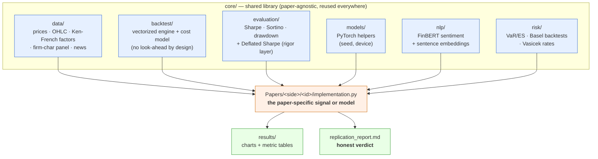
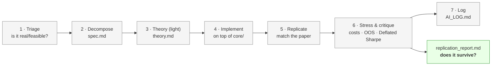
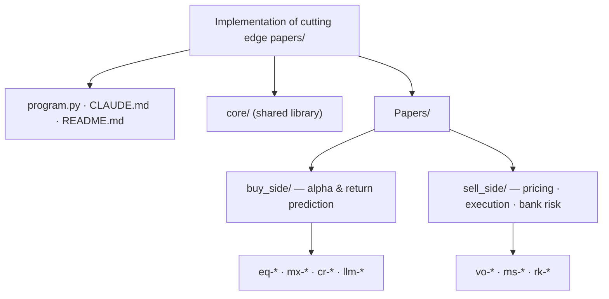

# Paper Catalog & Engineering Guide

A browsable menu of every paper in the program — pick the one that interests you and
we build it next — plus how the whole machine works under the hood.

- **Status legend:** ✅ built · 📄 PDF in folder, ready to build · ⛔ blocked (needs data/key)
- **To start one:** tell me the `id` (e.g. "build `vo-f2-rough-vol`").

---

## Part 1 — How the whole thing works (the engineering)

### The big idea
`core/` is a **shared library built once**; each paper is a **thin application** that
defines its signal/model and calls `core/`. So every new paper inherits data loading,
backtesting, statistical rigor, deep-learning and risk plumbing for free — the more
papers we do, the cheaper each new one gets.

### Architecture — how a paper flows through the code

### The 7-stage research loop (every paper runs this)

### What lives in `core/`
| Module | Provides | Built for |
|---|---|---|
| `core.data` | `get_prices`, `get_ohlc`, Ken-French `get_french_factors`, free firm-char `build_panel`, `news` | every paper |
| `core.backtest` | `backtest(weights, returns, cost_bps)` — vectorized P&L; **you lag your own signal** | every strategy paper |
| `core.evaluation` | performance metrics + **Deflated Sharpe Ratio** (multiple-testing honesty) | every paper |
| `core.models` | `set_seed`, `get_device` | the PyTorch papers |
| `core.nlp` | `score_sentiment` (FinBERT), `embed` | the LLM papers |
| `core.risk` | `var.py` (VaR/ES + Kupiec/Christoffersen/Basel), `rates.py` (Vasicek) | the `rk-*` papers |

### The repo at a glance

---

## Part 2 — ✅ Completed papers (for reference)

| ID | Side | Headline result |
|----|------|-----------------|
| `mx-00-tsmom` | buy | Time-series momentum: net Sharpe 0.55, Deflated Sharpe 0.98 (passes) |
| `eq-00-fama-french` | buy | Factor premia replicate; value/size **negative since 2010** |
| `eq-f1-eapml-gkx2020` | buy | ML asset pricing: nonlinear beats linear; GBM L/S Sharpe 0.65 |
| `eq-f2-virtue-complexity` | buy | Double-descent recovery shows; timing gain modest (contested paper) |
| `eq-f6-price-trends-cnn` | buy | CNN on chart images > coin-flip OOS (weak, overfits) |
| `cr-f1-crypto-factors` | buy | Market/size replicate; **momentum fails** Deflated Sharpe |
| `llm-f1-chatgpt-returns` | buy | FinBERT 84% acc; sentiment L/S Sharpe 1.44 (thin sample) |
| `vo-00-har-optiver` | sell | HAR vol: OOS R² 0.50 vs 0.40 random-walk |
| `vo-f1-deep-hedging` | sell | Beats Black-Scholes delta on mean + tail under costs |
| `rk-01-var-es-backtesting` | sell | VaR passes coverage but breaches **cluster** → motivates vol-scaled VaR |
| `rk-02-cva-exposure` | sell | Swap exposure hump; CVA 6.1 bps |
| `rk-03-credit-risk` | sell | Merton PDs; MC capital ≫ Basel IRB (concentration lesson) |
| `rk-04-evt-copulas` | sell | Normal understates 99.9% tail ~2×; t-copula > Gaussian |

---

## Part 3 — 📋 Available to build (the menu)

### 🟦 Buy-side

#### `mx-00-carry` — Carry, Koijen-Moskowitz-Pedersen-Vrugt (2018) 📄 *ready now*
**Idea:** "Carry" = the return you earn just for *holding* an asset if nothing moves
(a bond's roll-down, a high-yield currency's rate differential, futures roll). The
paper shows carry predicts returns in *every* asset class.
**You'd build:** a cross-asset carry signal (ETF/futures proxies + FRED rates) →
long high-carry / short low-carry → backtest with the rigor layer.
**Data:** prices + FRED (free) · **Difficulty:** low-med · **Engine:** `data`, `backtest`, `evaluation`.

#### `llm-f3-llm-embeddings` — Expected Returns & LLMs, Chen-Kelly-Xiu (2023) 📄 *ready now*
**Idea:** Don't just score sentiment — turn each news article into a numeric
**embedding** (a vector capturing meaning) and use those vectors as features to
predict the cross-section of returns.
**You'd build:** `core.nlp.embed` on Finnhub news → ridge/NN on embeddings → L/S
portfolio. Reuses the engine + your Finnhub key.
**Data:** news (have key) + prices · **Difficulty:** med · **Engine:** `nlp`, `data`, `evaluation`.

#### `cr-f2-text-returns-sestm` — Predicting Returns with Text (SESTM), Ke-Kelly-Xiu (2019) 📄 *ready now*
**Idea:** A *supervised* sentiment model — instead of a generic lexicon, **learn
which words predict returns** from the data itself, then score new text with that.
**You'd build:** a supervised word-scoring model on news + forward returns → ranked
sentiment → L/S. The pre-LLM "smart sentiment" baseline.
**Data:** news (have key) + prices · **Difficulty:** med · **Engine:** `nlp`/custom, `data`, `evaluation`.

#### `eq-f3-deep-learning-apt` — Deep Learning in Asset Pricing, Chen-Pelger-Zhu (2024) 📄
**Idea:** Estimate the **stochastic discount factor** (the thing that prices all
assets) with an *adversarial* network — one net proposes the SDF, another finds the
portfolios where it fails, GAN-style — enforcing no-arbitrage.
**You'd build:** reuse the free firm-char panel; train the adversarial SDF; price test
assets. **Difficulty:** high (adversarial training) · **Engine:** `data.panel`, `models`.

#### `eq-f4-deep-statarb` — Deep Learning Statistical Arbitrage, Guijarro-Ordonez et al. (2024) 📄
**Idea:** Extract market-neutral **residuals** (what's left after removing common
factors), then trade their mean-reversion with a CNN/transformer — end-to-end stat-arb.
**You'd build:** factor/PCA residuals from the panel → neural mean-reversion signal →
L/S. **Difficulty:** high · **Engine:** `data.panel`, `models`, `backtest`, `evaluation`.

#### `eq-f5-alphaportfolio` — AlphaPortfolio, Cong et al. (2021) 📄
**Idea:** Skip return prediction — train a **reinforcement-learning / transformer**
agent to output portfolio weights directly, maximizing Sharpe, with interpretability.
**You'd build:** sequence model on the panel optimizing a Sharpe-like reward.
**Difficulty:** high · **Engine:** `data.panel`, `models`, `evaluation`. *(Reproducibility is debated — good rigor test.)*

#### `llm-f2-fin-statements` — Financial Statement Analysis w/ LLMs, Kim-Muhn-Nikolaev (2024) ⛔
**Idea:** Feed an LLM **raw, anonymized financial statements** → it predicts earnings
direction, beating human analysts.
**Blocked:** needs an LLM that *reasons* (Type B). Free path = local LLM via **Ollama**
(your GPU) or Claude-in-session on a small sample. **Data:** SEC EDGAR (free).

#### `llm-f4-chatgpt-corporate` — ChatGPT & Corporate Policies, Jha et al. (2024) ⛔
**Idea:** An LLM scores corporate disclosures/calls → a firm-level signal for policies
and returns. **Blocked:** same as above (Type-B LLM reasoning). **Data:** EDGAR (free).

### 🟥 Sell-side

#### `vo-f2-rough-vol` — Volatility Is Rough, Gatheral-Jaisson-Rosenbaum (2018) 📄 *ready now*
**Idea:** Log-volatility behaves like **fractional Brownian motion with Hurst H ≈ 0.1**
— much "rougher" than classical models assume. Reshaped the whole vol-modeling field.
**You'd build:** estimate H from realized volatility (we already compute RV in
`vo-00`), demonstrate roughness, simulate a rough-vol path. **Difficulty:** med-high ·
**Engine:** `data` (RV), numpy/scipy.

#### `vo-f3-deep-vol-calib` — Deep Learning Volatility, Horvath-Muguruza-Tomas (2021) 📄
**Idea:** Calibrating a (rough) vol model to the market is slow. Train a **neural net
as a fast surrogate**: feed it an implied-vol surface, it outputs the model params
instantly. **You'd build:** simulate model→surface pairs, train the inverse NN.
**Difficulty:** high · **Engine:** `models`, simulation.

#### `vo-f4-quant-gans` — Quant GANs, Wiese et al. (2020) 📄
**Idea:** Train a **GAN** to generate synthetic price series that reproduce real
stylized facts (fat tails, vol clustering) — for robust backtesting & risk.
**You'd build:** a GAN on returns; evaluate generated vs real stylized facts.
**Difficulty:** high (GAN training) · **Engine:** `models`, `data`.

#### `ms-f1-deeplob` — DeepLOB, Zhang-Zohren-Roberts (2019) 📄
**Idea:** A **CNN+LSTM** reads the limit-order-book (price levels & sizes) and predicts
the next price move — market-making/HFT signal. **You'd build:** the net on LOB data.
**Data:** needs the free **FI-2010** LOB benchmark download (or crypto LOB via `ccxt`).
**Difficulty:** high · **Engine:** `models`.

#### `ms-f2-price-formation` — Universal Price Formation, Sirignano-Cont (2019) 📄
**Idea:** A deep net trained on many stocks' order books finds a **universal law** of
how price forms from order flow. **You'd build:** deep net on LOB → price-change
prediction; test universality. **Data:** LOB (FI-2010 / crypto) · **Difficulty:** high.

#### `ms-f3-rl-execution` — Deep RL Optimal Execution, Ning-Lin-Jaimungal (2021) 📄
**Idea:** An **RL agent** learns how to slice a large order to minimize cost+risk,
beating the classic Almgren-Chriss schedule. **You'd build:** a simulated LOB / market-
impact env + a DQN agent vs Almgren-Chriss. **Data:** simulated · **Difficulty:** high ·
**Engine:** `models`.

#### `rk-f1-differential-ml` — Differential Machine Learning, Huge & Savine / Danske Bank (2020) 📄 *PDF just added*
**Idea:** Train ML pricing/risk approximators using **both prices AND their pathwise
derivatives (Greeks via AAD)** as training labels — giving fast, accurate, real-time
pricing and risk for any derivative. A landmark *bank* risk-quant paper (famous GitHub).
**You'd build:** simulate payoffs + pathwise deltas, train a "differential" network,
show it beats a value-only net. **Difficulty:** med-high · **Engine:** `models`, simulation.

#### `rk-f2-deep-xva` — Deep xVA Solver, Gnoatto-Picarelli-Reisinger (2020) 📄 *PDF just added*
**Idea:** Compute **XVA (CVA/FVA/…)** for high-dimensional books by solving the
valuation-adjustment **BSDEs with a neural-network solver** — where classical grids
fail. Directly extends `rk-02`. **You'd build:** a deep-BSDE solver for exposure/XVA.
**Difficulty:** high · **Engine:** `models`, `risk.rates`, simulation.

#### `rk-f3-ml-var` — ML for VaR/ES (quantile-regression neural nets) ⛔ *no paper chosen yet*
**Idea:** Predict VaR/ES directly with **quantile-regression neural nets** that adapt
to volatility — fixing the breach-clustering we saw in `rk-01`.
**To start:** pick a specific paper (I can surface candidates). **Data:** prices (have).

---

## Quick picks
- **Zero friction (no download, no key), high signal:** `mx-00-carry`, `vo-f2-rough-vol`,
  `rk-f1-differential-ml`.
- **Uses your Finnhub key + NLP engine:** `llm-f3-llm-embeddings`, `cr-f2-text-returns-sestm`.
- **Most impressive "frontier ML" portfolio pieces:** `eq-f4-deep-statarb`,
  `rk-f1-differential-ml`, `vo-f4-quant-gans`.
- **Needs a data download first:** `ms-f1-deeplob`, `ms-f2-price-formation` (FI-2010 LOB).
- **Needs a local LLM (Ollama):** `llm-f2-fin-statements`, `llm-f4-chatgpt-corporate`.
